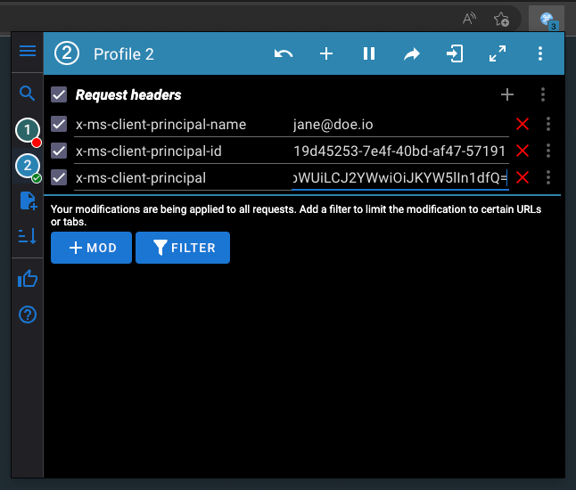

# Generating Microsoft Identity Principal for Local Development

When working with [Microsoft Identity Platform integration](../backend/microsoft-identity.md) in your application, you'll often need to test different user identities and claims during local development. Since local development environments typically don't have Microsoft Azure's identity provider configured, you need to simulate the Microsoft Client Principal tokens that would normally be provided by Azure services like Container Apps or Web Apps.

The [Microsoft Identity backend integration](../backend/microsoft-identity.md) relies on specific HTTP headers that are automatically set by Azure services in production, but need to be manually configured during local development:

| Header | Description |
| ------ | ----------- |
| x-ms-client-principal | The Microsoft Client Principal token holding all user details, base64 encoded according to [Microsoft Client Principal Data definition](https://learn.microsoft.com/en-us/azure/static-web-apps/user-information?tabs=csharp#client-principal-data) |
| x-ms-client-principal-id | The unique identifier from the Microsoft identity provider (Azure AD/Entra ID) for the user |
| x-ms-client-principal-name | The display name of the user, typically resolved from claims within the Microsoft identity token |

Once these Microsoft Identity headers are properly set and the `x-ms-client-principal` token is in the expected format, the [Microsoft Identity authentication handler](../backend/microsoft-identity.md) will process them and pass the identity information to your **identity details provider**.

The expected format needs to be according to the [Microsoft Client Principal Data definition](https://learn.microsoft.com/en-us/azure/static-web-apps/user-information?tabs=csharp#client-principal-data).
To simulate Microsoft Identity users during local development, generate the correct token values and use a browser extension to set the HTTP request headers.

Here's an example of a Microsoft Client Principal token structure for an Azure AD user:

```json
{
  "identityProvider": "aad",
  "userId": "e7f664ca-4ecc-45be-84cf-74b6240d049a",
  "userDetails": "jane.doe@contoso.com",
  "userRoles": ["anonymous", "authenticated"],
  "claims": [{
    "typ": "preferred_username",
    "val": "jane.doe@contoso.com"
  }, {
    "typ": "name",
    "val": "Jane Doe"
  }, {
    "typ": "given_name",
    "val": "Jane"
  }, {
    "typ": "family_name",
    "val": "Doe"
  }, {
    "typ": "oid",
    "val": "e7f664ca-4ecc-45be-84cf-74b6240d049a"
  }]
}
```

Basically what you then need to do is generate a Microsoft Client Principal token that matches the structure above and `Base64` encode it.
If you're using VSCode, you could use an [extension](https://marketplace.visualstudio.com/items?itemName=adamhartford.vscode-base64) for doing the base64 encoding.
As an alternative, you could also use an online base64 encoder like [this](https://www.base64encode.org).

For the above Microsoft Identity structure that would become:

```text
ewogICJpZGVudGl0eVByb3ZpZGVyIjogImFhZCIsCiAgInVzZXJJZCI6ICJlN2Y2NjRjYS00ZWNjLTQ1YmUtODRjZi03NGI2MjQwZDA0OWEiLAogICJ1c2VyRGV0YWlscyI6ICJqYW5lLmRvZUBjb250b3NvLmNvbSIsCiAgInVzZXJSb2xlcyI6IFsiYW5vbnltb3VzIiwgImF1dGhlbnRpY2F0ZWQiXSwKICAiY2xhaW1zIjogW3sKICAgICJ0eXAiOiAicHJlZmVycmVkX3VzZXJuYW1lIiwKICAgICJ2YWwiOiAiamFuZS5kb2VAY29udG9zby5jb20iCiAgfSwgewogICAgInR5cCI6ICJuYW1lIiwKICAgICJ2YWwiOiAiSmFuZSBEb2UiCiAgfSwgewogICAgInR5cCI6ICJnaXZlbl9uYW1lIiwKICAgICJ2YWwiOiAiSmFuZSIKICB9LCB7CiAgICAidHlwIjogImZhbWlseV9uYW1lIiwKICAgICJ2YWwiOiAiRG9lIgogIH0sIHsKICAgICJ0eXAiOiAib2lkIiwKICAgICJ2YWwiOiAiZTdmNjY0Y2EtNGVjYy00NWJlLTg0Y2YtNzRiNjI0MGQwNDlhIgogIH1dCn0K
```

From the terminal on a Unix based operating system you could also generate a base64 encoded Microsoft Client Principal:

```shell
echo "{\"identityProvider\":\"aad\",\"userId\":\"e7f664ca-4ecc-45be-84cf-74b6240d049a\",\"userDetails\":\"jane.doe@contoso.com\"}" | base64
```

Which would generate:

```text
eyJpZGVudGl0eVByb3ZpZGVyIjoiYWFkIiwidXNlcklkIjoiZTdmNjY0Y2EtNGVjYy00NWJlLTg0Y2YtNzRiNjI0MGQwNDlhIiwidXNlckRldGFpbHMiOiJqYW5lLmRvZUBjb250b3NvLmNvbSJ9Cg==
```

## ModHeader for Microsoft Identity Testing

Once you have the Microsoft Client Principal token as **base64**, you can inject it as headers for testing your [Microsoft Identity integration](../backend/microsoft-identity.md) locally.

In your browser you can use an extension such as [ModHeader](https://modheader.com). It allows you to setup headers
that simulate the Azure-provided Microsoft Identity headers for local development. Use this to add the expected Microsoft Identity headers:

- The `x-ms-client-principal-id` should be the Azure AD object identifier (oid) or user ID from your identity provider
- The `x-ms-client-principal-name` should be the user's display name or email address from Azure AD  
- The `x-ms-client-principal` should contain your base64-encoded Microsoft Client Principal token

> Important: For the `x-ms-client-principal` you want to paste the **base64** generated value. Ensure the base64 string is properly formatted and valid.



> Pro-tip: With ModHeader you can create profiles. This is super useful if you want to be testing with different Microsoft Identity users and easily switch between them during development.

## Integration with Microsoft Identity Backend

Once you have these headers configured, your application's [Microsoft Identity authentication handler](../backend/microsoft-identity.md) will automatically process the Microsoft Client Principal token and populate the ASP.NET Core authentication context. This allows you to:

- Test authorization policies that depend on Azure AD claims
- Verify that your [identity details provider](../backend/identity.md) receives the correct user information
- Ensure your application behaves correctly with different Microsoft Identity user scenarios

The Microsoft Identity integration seamlessly handles the token validation and claim extraction, making your local development experience consistent with how the application behaves when deployed to Azure services.
